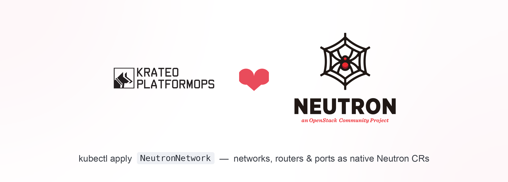

<p align="center">
  
</p>

# openstack-neutron-operator-kog

## What is this

A Krateo Operator Generator (KOG) blueprint that turns **OpenStack Neutron (networking v2.0)**
resources into native Kubernetes custom resources — no hand-written controller, just a curated
OpenAPI subset per resource plus the generic
[`rest-dynamic-controller`](https://github.com/krateo-platformops/rest-dynamic-controller), wired up by
[`oasgen-provider`](https://github.com/krateo-platformops/oasgen-provider).

`kubectl apply` a `NeutronNetwork` / `NeutronSubnet` / … CR and it is reconciled into a real Neutron
object.

| Kind | Neutron API | Verbs |
|------|-------------|-------|
| `NeutronNetwork` | `/v2.0/networks` | create / get / update / delete |
| `NeutronSubnet` | `/v2.0/subnets` | create / get / update / delete |
| `NeutronRouter` | `/v2.0/routers` | create / get / update / delete |
| `NeutronPort` | `/v2.0/ports` | create / get / update / delete |
| `NeutronSecurityGroup` | `/v2.0/security-groups` | create / get / update / delete |
| `NeutronSecurityGroupRule` | `/v2.0/security-group-rules` | create / get / delete (immutable) |
| `NeutronFloatingIP` | `/v2.0/floatingips` | create / get / update / delete |

Every payload is envelope-wrapped (`{network:{…}}`, `{subnet:{…}}`, …), so each Kind is prefixed
`Neutron*` to avoid the crdgen Kind-vs-property collision. All Kinds share the API group
`network.openstack.krateo.io`.

**Auth:** the generated controller speaks plain HTTP and can't do Keystone token exchange. This chart
ships a small **auth-bridge** ([`chart/scripts/openstack-auth-proxy.py`](chart/scripts/openstack-auth-proxy.py))
that authenticates with a `clouds.yaml`, discovers the `network` endpoint, and injects a fresh
`X-Auth-Token` on every call — in-cluster, no public-DNS resolver trap.

## Install

Prerequisite — the Krateo KOG provider in the cluster:

```bash
helm repo add krateo https://charts.krateo.io && helm repo update
helm upgrade --install oasgen-provider krateo/oasgen-provider -n krateo-system --create-namespace
```

Supply the admin `clouds.yaml` in a Secret, then install the operator:

```bash
kubectl -n krateo-system create secret generic neutron-clouds --from-file=clouds.yaml=clouds.yaml

helm upgrade --install neutron-kog \
  oci://ghcr.io/krateo-blueprints/charts/openstack-neutron-operator-kog \
  -n krateo-system --create-namespace \
  --set authBridge.upstreamEndpoint=http://neutron-server.openstack.svc.cluster.local:9696
```

Or install it as a Krateo Composition:

```bash
kubectl apply -f compositiondefinition.yaml
kubectl apply -f examples/neutron-operator/composition.yaml
```

## Configure

All configuration is [`chart/values.yaml`](chart/values.yaml), typed by
[`chart/values.schema.json`](chart/values.schema.json):

- `restdefinitions.<resource>.enabled` — toggle each of the seven resources (network, subnet, router,
  port, security_group, security_group_rule, floatingip).
- `authBridge.*` — the Keystone-auth proxy: `cloudsSecret`, `osCloud`, `serviceType`, `osInterface`,
  `upstreamEndpoint` (empty = auto-discover), `image`, `service`, `resources`.

Full reference: [docs/configuration.md](docs/configuration.md).

## Examples

- [examples/neutron-operator](examples/neutron-operator/README.md) — install the operator as a
  Composition, then create sample Neutron CRs (network, subnet, security group, rule).
- Sample Neutron CRs are also bundled at
  [chart/samples/network-resources.yaml](chart/samples/network-resources.yaml).

```bash
kubectl -n krateo-system apply -f chart/samples/network-resources.yaml
kubectl -n krateo-system get neutronnetworks.network.openstack.krateo.io -w
```

Cross-resource references are by OpenStack UUID — read the id from the referenced CR's
`status.<envelope>.id` and wire it into the dependent CR (e.g. `NeutronSubnet.spec.subnet.network_id`),
or sequence them with a Composition. `NeutronSecurityGroupRule` is immutable — change a rule by
deleting and recreating the CR.

## Docs

- [docs/index.md](docs/index.md) — the doc bundle map
- [docs/overview.md](docs/overview.md) — architecture: the KOG model, the auth-bridge, the naming convention
- [docs/usage.md](docs/usage.md) — install, supply creds, apply CRs, verify
- [docs/configuration.md](docs/configuration.md) — the whole values surface
- [docs/api.md](docs/api.md) — the CompositionDefinition and the generated Neutron CRDs
- [docs/examples.md](docs/examples.md) — the runnable examples
- [docs/release.md](docs/release.md) — how a release ships
- [docs/log.md](docs/log.md) — curated history
- [docs/quickstart.md](docs/quickstart.md) — end-to-end walkthrough with Horizon screenshots
- [docs/llms.txt](docs/llms.txt) — one-line-per-file index for LLMs

## Develop & release

The chart is published to `oci://ghcr.io/krateo-blueprints/charts/openstack-neutron-operator-kog` by
the `release-chart` workflow ([`.github/workflows/release-chart.yaml`](.github/workflows/release-chart.yaml))
on a SemVer git tag that matches `chart/Chart.yaml` `version` (no `v` prefix):

```bash
git tag 0.1.0 && git push origin 0.1.0
```

Documentation is linted on pull requests by the `lint-docs` job
([`.github/workflows/lint.yaml`](.github/workflows/lint.yaml)). See [docs/release.md](docs/release.md)
for the full runbook.

## License

Apache-2.0 — see [LICENSE](LICENSE).
