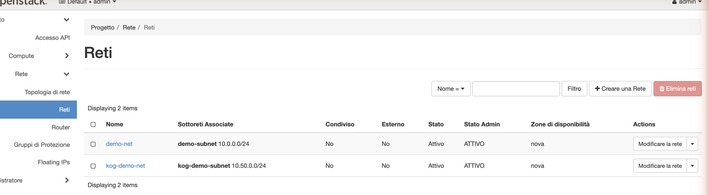
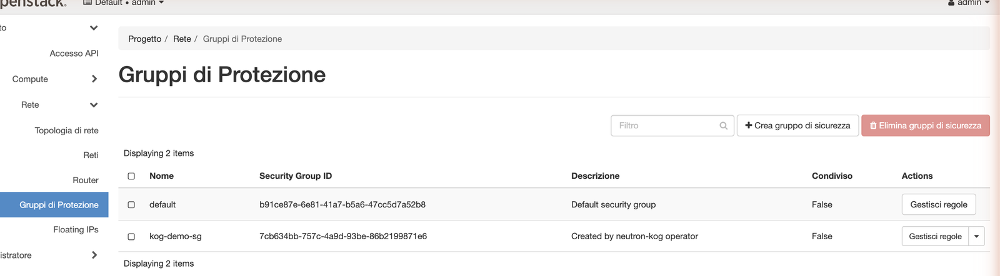

# Quickstart — Neutron (network) operator

Manage OpenStack **Neutron** networking as Kubernetes CRs. End to end: install the
operator, `kubectl apply` a `NeutronNetwork` + `NeutronSubnet` + `NeutronSecurityGroup`,
and watch them appear in the Horizon dashboard.

## 1. Prerequisites

Krateo's KOG provider in the cluster:

```bash
helm repo add krateo https://charts.krateo.io && helm repo update
helm upgrade --install oasgen-provider krateo/oasgen-provider -n krateo-system --create-namespace
```

An admin `clouds.yaml` for your OpenStack, stored in a Secret:

```bash
kubectl -n krateo-system create secret generic neutron-clouds --from-file=clouds.yaml=clouds.yaml
```

## 2. Install the operator

```bash
helm upgrade --install neutron-kog ./chart -n krateo-system \
  --set authBridge.upstreamEndpoint=http://neutron-server.openstack.svc.cluster.local:9696
kubectl -n krateo-system wait restdefinition/neutron-kog-network --for=condition=Ready --timeout=300s
```

## 3. Create a network, a subnet, and a security group

```bash
kubectl -n krateo-system create secret generic neutron-token --from-literal=token=managed-by-proxy
cat <<'EOF' | kubectl apply -f -
apiVersion: network.openstack.krateo.io/v1alpha1
kind: NeutronNetworkConfiguration
metadata: {name: neutron-config, namespace: krateo-system}
spec: {authentication: {bearer: {tokenRef: {name: neutron-token, namespace: krateo-system, key: token}}}}
---
apiVersion: network.openstack.krateo.io/v1alpha1
kind: NeutronNetwork
metadata: {name: kog-demo-net, namespace: krateo-system}
spec:
  configurationRef: {name: neutron-config, namespace: krateo-system}
  network: {name: kog-demo-net, admin_state_up: true}
---
apiVersion: network.openstack.krateo.io/v1alpha1
kind: NeutronSecurityGroup
metadata: {name: kog-demo-sg, namespace: krateo-system}
spec:
  configurationRef: {name: neutron-config, namespace: krateo-system}   # a NeutronSecurityGroupConfiguration
  security_group: {name: kog-demo-sg, description: "Created by neutron-kog operator"}
EOF
```

Read the network's id from its status, then create a subnet referencing it:

```bash
NETID=$(kubectl -n krateo-system get neutronnetwork kog-demo-net -o jsonpath='{.status.network.id}')
cat <<EOF | kubectl apply -f -
apiVersion: network.openstack.krateo.io/v1alpha1
kind: NeutronSubnet
metadata: {name: kog-demo-subnet, namespace: krateo-system}
spec:
  configurationRef: {name: neutron-config, namespace: krateo-system}   # a NeutronSubnetConfiguration
  subnet:
    name: kog-demo-subnet
    network_id: "$NETID"
    cidr: "10.50.0.0/24"
    ip_version: 4
    enable_dhcp: true
EOF
```

> Each Kind references its own `<Kind>Configuration` (same token Secret). Create one
> `NeutronSecurityGroupConfiguration` / `NeutronSubnetConfiguration` etc. as needed.

## 4. See it in Horizon

The network (with its subnet) appears under **Network → Networks**:



…and the security group under **Network → Security Groups** — note the description:



`NeutronRouter`, `NeutronPort`, `NeutronSecurityGroupRule` and `NeutronFloatingIP`
follow the same pattern.
